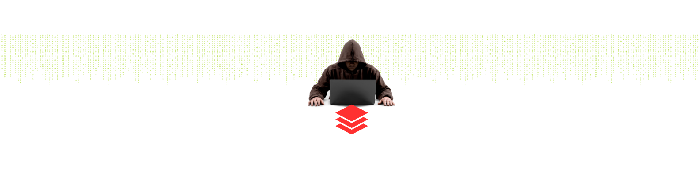

<!--
**Ivan-Jesus-Fernandez/Ivan-Jesus-Fernandez** is a ✨ _special_ ✨ repository because its `README.md` (this file) appears on your GitHub profile.

Here are some ideas to get you started:

- 🔭 I’m currently working on ...
- 🌱 I’m currently learning ...
- 👯 I’m looking to collaborate on ...
- 🤔 I’m looking for help with ...
- 💬 Ask me about ...
- 📫 How to reach me: ...
- 😄 Pronouns: ...
- ⚡ Fun fact: ...
-->

---

<!--Header: end-->

<!--Social Links Badges: start-->

 
 

  

<!--Social Links Badges: end-->

<!--About me: start-->
  
  
Greetings 👋, my name is Ivan Fernandez, I am a dedicated graduate student pursuing a Master of Science in Mechanical Engineering. My primary goal is to deepen my knowledge of this exciting field through a combination of education, industry experience, and research projects.

<!--About me: end-->

<!--Tech stack: start-->

  
  ---
<!--Tech stack: end-->

<!--Statistics: start-->

  
  

<!--Statistics: end-->

<!--More Details: start-->

---

### Languages 🌐

| Language      | Proficiency                                                               |
| ------------- | ------------------------------------------------------------------------- |
| English       | Native or bilingual                                                       |
| Spanish       | Native or bilingual                                                                    

---

### Education 📚 : 

<!-- CURRENT:START -->
<ul>

<li>  <strong>California State University, Fullerton </strong></li>
Master of Science - M.Sc, Mechanical Engineering 2021 - 2023

 Relevant Coursework: In progress. 

<li>  <strong>UC San Diego (ABET Accredited) </strong> </li>
Bachelor of Science - B.Sc, Aerospace Structural Engineering
2018 - 2021
  
 

Relevant Coursework: Finite Element Analysis (FEA) I & II, MATLAB Programming, Vibrations, Computer-Aided Design (CAD), Solid Mechanics I & II, Fluid Mechanics, Nondestructive Testing, Statistics: Probability & Reliability, Structural Analysis I & II, Statics, Dynamics, Materials Science, Design of Composite Structures, Renewable Energy: Solar & Wind, Aerospace Structural Mechanics I & II, Aerospace Structural Design I & II, Aerospace Structures Repair. 

</ul>

<!-- CURRENT:END -->

---
### Projects :

<!-- TOP-FIVE:START -->

<ul>
<li> <strong> SE143B Aerospace Structural Design IISE143B Aerospace Structural Design II
 </strong> </li>
Apr 2021 - Jun 2021
  
 <u>Goal <u> :  The goal of this aerospace structural engineering project is to analyze material constraints and costs, determine risks associated with proposed designs, and fabricate the most cost-efficient and safest composite space component– one boom of a solar sail. I also designed the winder mechanism that would be utilized for deployment and testing purposes. Oral presentation and multidisciplinary design optimization. Aerospace computer-aided design and analysis tools. Use of computer resources such as Abaqus (FEA), MATLAB programming and Solidworks (CAD). 

 - Link to the project ==>(https://drive.google.com/file/d/1A3IjvfKVOPqHnF6wEejXWqrSUU-QBQAl/view) 

    <li> .</li>
  <li> <strong> SE143A Aerospace Structural Design ISE143A Aerospace Structural Design I </strong> </li>
Jan 2021 - Mar 2021
  
 Goal :  The goal of this aerospace structural engineering project is to perform theoretical and cost analyses in order to characterize the behavior of different solar sail boom designs. Three designs including CTM, TRAC, and Double-TRAC were investigated. Design 3, that is the Double TRAC, was down-selected after considering cost, feasibility, theoretical analyses, and margins of safety. Oral presentation and multidisciplinary design optimization. Aerospace computer-aided design and analysis tools. Use of computer resources such as Abaqus (FEA), MATLAB programming and Solidworks (CAD). 

- Link to the project ==>(https://drive.google.com/file/d/1u52KoOvXfJS3_RzBqWo7iQAn6jB2moVX/view) 
    
</ul>
<!-- TOP-FIVE:END -->

<!--More Details: end-->

<!--Footer: start-->

---

 

